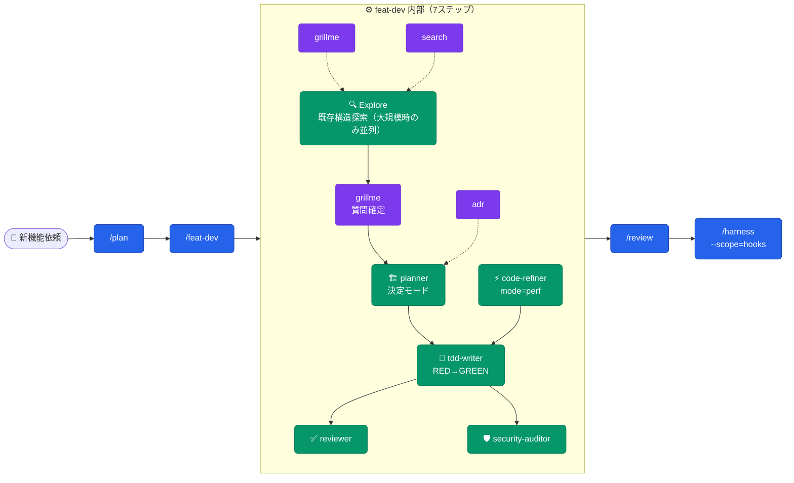
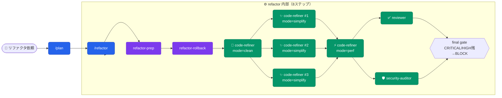
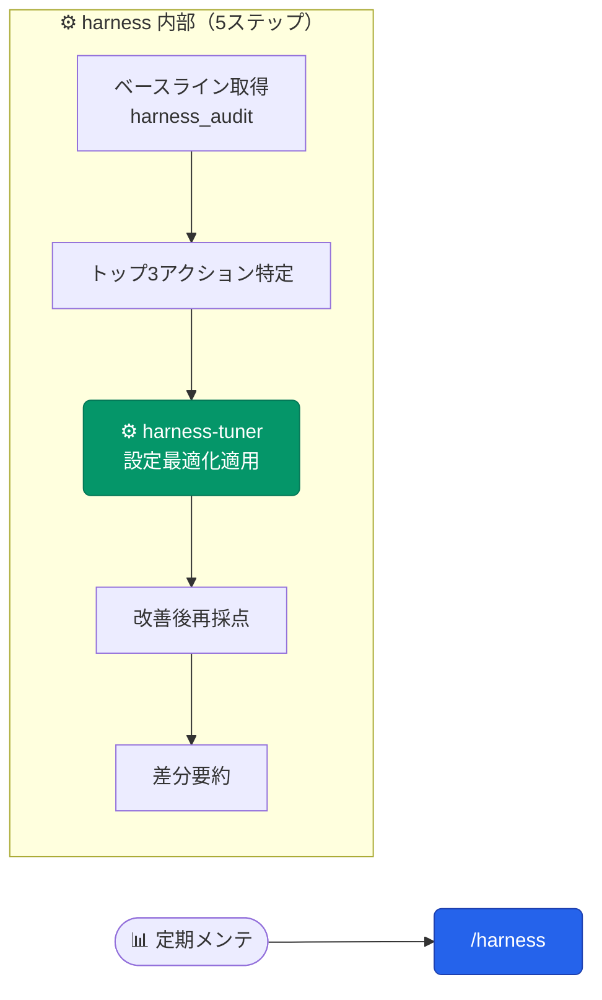
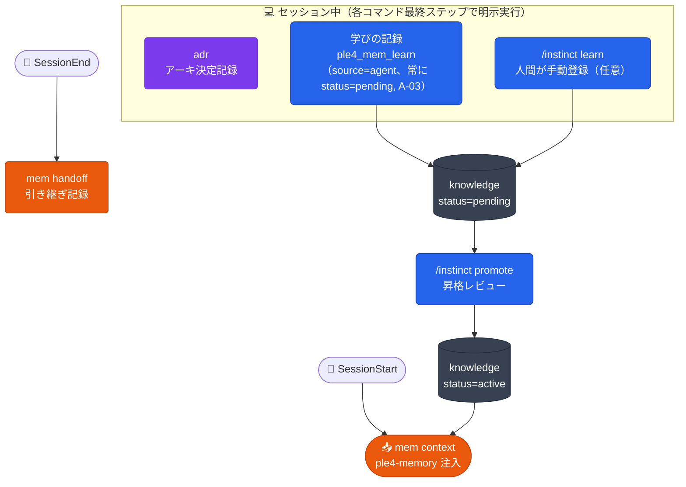
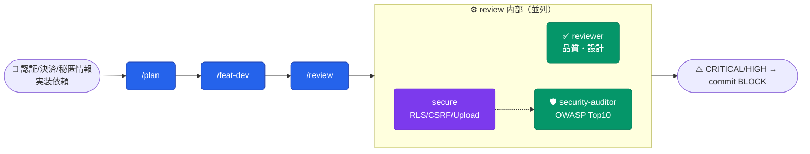
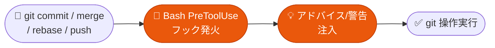
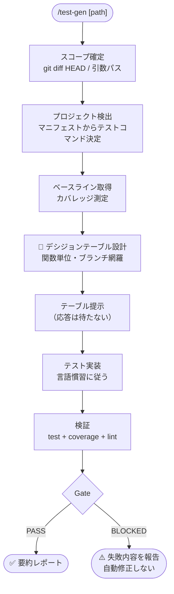
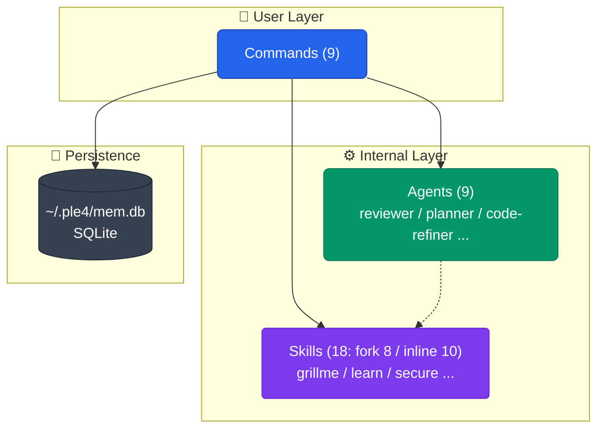

# ple4

Claude Code 向けの汎用プラグイン集です。エージェント、スキル、コマンド、フック、永続メモリをひとまとめに導入し、計画・実装・検証・レビューの流れを揃えます。

## これは何か

ple4 は、Claude Code の作業を「最初の計画からレビューまで」通して支えるプラグインです。
ユーザープロジェクトの言語ランタイムに依存せず、必要なときだけ個別のツールやコマンドを使います。

---

## 想定読者

本 README は **ple4 プラグインを Claude Code に導入する開発者** 向けです。

- Claude Code 自体の基本操作（プロンプト送信、ファイル編集の許可など）は前提とします。
- Claude Code がまだの場合は、まず公式の Claude Code を導入してから本プラグインを使ってください。
- 初心者は **WF-2（バグ修正）** から試すと最も簡単で、効果を体感しやすいです。

---

## 特長

| 項目 | 内容 |
| --- | --- |
| Agents | 計画、レビュー、TDD、セキュリティ、性能、探索などの専門サブエージェント |
| Skills | ワークフローや運用知識を段階的に案内 |
| Commands | 定番作業をすぐ呼び出し |
| Hooks | ツール実行の前後に自動チェックや記録を実行 |
| Memory | 知識カードと引き継ぎを SQLite（`~/.ple4/mem.db`）に保持 |

---

## 用語

5つの要素を理解すれば ple4 の全フローが追えます。

| 用語 | 種別 | 起動方法 | 例 |
|---|---|---|---|
| **Command** | ユーザーが明示的に呼ぶ | `/<name> [args]` | `/plan`, `/review`, `/feat-dev` |
| **Agent** | 内部から委譲される専門家 | コマンド / skill から `Task` ツール経由で `subagent_type` 指定起動 | `reviewer`, `planner`, `tdd-writer` |
| **Skill** | 条件発火 or 委譲先の知識モジュール | description マッチで Claude Code が自動起動 / inline 展開 or fork 委譲（`context` で決まる） | `grillme`, `learn`, `skill-make` |
| **Knowledge** | 蓄積された知識カード（罠・規約・手順・事実） | SessionStart で `<ple4-memory>` として自動注入（`status='active'` のみ） | `/instinct` で棚卸し・昇格 |
| **Hook** | ツール実行時に自動発火するスクリプト | `hooks.json` 登録 → Claude Code が呼ぶ | PreToolUse, SessionStart, SessionEnd |

**ざっくりまとめると**: ユーザーは Command だけを覚えれば OK。Command が内部で必要な Agent / Skill を自動で連れてきます。Knowledge と Hook はバックグラウンドで動く仕組みです。

> **保護フックの保証範囲**: `block_no_verify` / `pre_bash_commit_quality` /
> `bash_config_protection` / `config_protection` は **best-effort な事故防止**であり、
> **敵対的な回避への防壁ではありません**（[ADR-0002](docs/adr/02-shell-analysis-boundary.md)）。
> シェルエイリアス・シェル関数・変数展開・コマンド置換・2 段以上の `sh -c` / `eval`・
> `git` 以外の名前を持つラッパースクリプト経由の呼び出しは、意図的に非目標として
> 検出しません（POSIX シェルの意味解釈は実行時環境に依存し、静的解析だけでは
> 原理的に再現できないため）。回避を防ぐ必要がある場面では、フックではなく
> サーバ側の検証（受信 commit の署名・テスト・policy 適合）で担保してください。

---

## クイックスタート

### 対応環境

- OS: macOS / Linux（Windows は未対応。フックの stdin 読み取りが `select.select` に依存しており、Windows の通常 console stdin では機能しない可能性があるため）
- `python3` 3.12 以上（PATH 上で解決できること。ランタイムは venv を作らない）。3.12 未満では保護フックが警告付きで無効化される

### プラグインマーケットプレイス

```bash
claude plugin marketplace add aokumablue/ple4
claude plugin install ple4@ple4
```

インストール後、まず試すなら:

```bash
/bugfix "ログイン時に 500 エラーが出る" src/auth/
```

---

## 🚀 Commands (9)

各コマンドの詳細はリンク先 `.md` ファイル参照。

| コマンド | 用途 | 引数 | 一言説明 |
|---|---|---|---|
| [`/plan`](plugins/ple4/commands/plan.md) | 実装前計画 | `[要件説明]` | 要件言い換え→リスク評価→段階的計画。コード前にユーザー確認 |
| [`/feat-dev`](plugins/ple4/commands/feat-dev.md) | 新機能開発 | `[機能説明]` | 発見→探索→質問→設計→実装→レビュー の7段階一気通貫 |
| [`/bugfix`](plugins/ple4/commands/bugfix.md) | バグ修正 | `[症状] [パス]` | 再現→原因分析→最小修正→回帰防止→レビュー の一気通貫 |
| [`/refactor`](plugins/ple4/commands/refactor.md) | リファクタリング | `[パス] [--mode=simplify\|clean]` | clean→simplify→perf→review の安全な自動連鎖。`--mode` で部分実行 |
| [`/review`](plugins/ple4/commands/review.md) | コードレビュー | `[パス]`（省略=差分） | reviewer + security-auditor 並列。**READ-ONLY 厳守**（security-auditor はツール権限で技術的強制、reviewer はプロンプト指示ベース） |
| [`/harness`](plugins/ple4/commands/harness.md) | 品質管理 | `[scope] [--audit-only] [--format=text\|json]` | スコア取得→harness-tuner で改善→再採点 |
| [`/skill-gen`](plugins/ple4/commands/skill-gen.md) | スキル作成 | `[--commits=N] [--output=path] [--knowledge]` | 入力収集→skill-make→skill-tune→grader/comparator/bench-analyzer 評価 |
| [`/instinct`](plugins/ple4/commands/instinct.md) | 知識管理 | `<list\|show\|search\|promote\|forget\|learn>` | 知識カードの棚卸し・昇格（`pending` → `active`）・アーカイブ |
| [`/test-gen`](plugins/ple4/commands/test-gen.md) | テストコード自動生成 | `[パス]`（省略=差分） | デシジョンテーブル設計→承認→実装。言語非依存 |

---

## 🧭 Workflows

ple4 が「どの場面でどう動くか」を 11 のワークフロー図で示します。各図には **コマンド・エージェント・スキル・自動処理** が登場します。

### 凡例

WF 図で繰り返し使う色・線・記号の意味は以下で統一しています。

| 色 | 種別 | 役割 |
|---|---|---|
| 🔵 **青** (#2563eb) | Command | ユーザーが明示的に呼ぶ |
| 🟢 **緑** (#059669) | Agent | 内部から委譲される専門家 |
| 🟣 **紫** (#7c3aed) | Skill / Hook | 条件発火する知識モジュール |
| 🟠 **橙** (#ea580c) | 自動処理 | システム側で自動発火（SessionStart 等） |
| ⬛ **灰** (#374151) | 永続化ストア | SQLite |

| 線種 | 意味 |
|---|---|
| 実線 `-->` | 同期的呼び出し・必須遷移（処理が完了するまで次に進まない） |
| 点線 `-.->`| 任意・条件付き・並行参照（補助的に動く） |
| `&` 連結 | 並列実行（複数を同時に走らせて結果をマージ） |
| subgraph 枠 | 1つのコマンド内部の処理単位（外から見ると1コマンド） |
| 菱形 `{...}` | 条件分岐（YES/NO 判定） |

**初心者向けの読み方**: まず 🔵 のコマンドだけ目で追えば「ユーザー操作の流れ」がわかります。🟢🟣 は気にしなくて OK。慣れてきたら subgraph の中を覗いてください。

---

### WF-1: 新機能開発



**トリガー**: 新機能実装・機能拡張・中規模リファクタリング
**期待効果**: 探索→設計→実装→レビュー→セキュリティ検証が自動連鎖。段階飛ばし禁止のため既存パターン無視・重複実装が起きない

**実行例**:

```bash
/plan "ユーザー認証に 2FA を追加"
/feat-dev
```

**難度**: ★★★☆☆ (中)
**想定所要時間**: 探索 10分 / 設計 15分 / 実装 30分〜

---

### WF-2: バグ修正


**トリガー**: バグ修正・不具合対応
**期待効果**: 再現テストを先に作るので「再現できないバグ」を直したつもりが残らない。回帰防止テストも自動追加

**実行例**:

```bash
/bugfix "ログイン直後にダッシュボードが空になる" src/dashboard/
```

**難度**: ★★☆☆☆ (初心者向け)
**想定所要時間**: 再現 10分 / 修正 10分 / 検証 5分

---

### WF-3: フルリファクタリング



**トリガー**: 5件以上のリファクタ・大規模コード整理
**期待効果**: clean → simplify（並列）→ perf → review を安全に自動連鎖。各段階の失敗は即ファイル単位でリバート、CRITICAL/HIGH 残存時は最終 gate でブロック

**実行例**:

```bash
/plan "認証層のユーティリティ重複を整理"
/refactor src/auth/
```

**難度**: ★★★★☆ (上級)
**想定所要時間**: prep 5分 / clean 10分 / simplify 20分 / perf 15分 / review 10分

---

### WF-4: コード単純化のみ


**トリガー**: 可読性・保守性向上のみ、機能変更なし
**期待効果**: 最大並列でファイルグループを同時単純化。clean / perf はスキップ

**実行例**:

```bash
/refactor --mode=simplify src/api/
```

**難度**: ★★☆☆☆ (初心者向け)
**想定所要時間**: 10〜20分

---

### WF-5: デッドコード掃除


**トリガー**: 未使用コード・依存関係の削除
**期待効果**: 削除ごとにテスト実行、失敗時は即リバート。安全に dead code を排除

**実行例**:

```bash
/refactor --mode=clean
```

**難度**: ★☆☆☆☆ (最易)
**想定所要時間**: 5〜10分

---

### WF-6: スキル新規作成・改善


**トリガー**: 新スキル作成・既存スキル改善
**期待効果**: 生成→eval→ベンチマーク分析が自動連鎖。連続2回で新規不明瞭点ゼロ、または同一勝者で収束判定

**実行例**:

```bash
/skill-gen --commits=200 --knowledge
```

**難度**: ★★★★☆ (上級)
**想定所要時間**: 20〜40分（反復回数次第）

---

### WF-7: 品質管理サイクル（定期メンテ）



**トリガー**: 週次・月次の品質チェック
**期待効果**: ハーネスで自動採点 → harness-tuner で改善案を適用 → 再採点で効果検証

**実行例**:

```bash
/harness repo
```

**難度**: ★★☆☆☆ (初心者向け)
**想定所要時間**: harness 10分

---

### WF-8: 知識蓄積サイクル

各コマンド末尾の「学びの記録」ステップ（`/review` `/refactor` `/bugfix` `maintain` 等）で
agent/skill が明示的に `ple4_mem_learn` を呼ぶことで知識カードが増える。自動バックグラウンド観測（旧
session-observer）は廃止済み — 定期実行や無操作での自動蓄積はない。



**トリガー**: 各コマンドの「学びの記録」ステップ（agent/skill が明示的に判断・実行。ユーザー操作は不要だがコマンド実行が前提）
**期待効果**: 再利用可能な学び（罠・規約・決定）が知識カードとして蓄積し次セッション以降へ自動注入。agent 由来カード（`ple4_mem_learn`）は**常に** `status=pending` で登録され、`/instinct promote <key>` を経て初めて注入される（A-03）。`learn` に `--status` は無く、helper も CLI も指定を拒否する

**実行例**: 通常操作不要（各コマンドが完了時に自動判断）。手動登録した pending 分だけ週次で `/instinct list --status pending` → 採用分を `/instinct promote <key>`

**難度**: ★☆☆☆☆ (自動)
**想定所要時間**: 各コマンド実行時に数秒（記録が該当する場合のみ）

---

### WF-9: セキュリティ重視の実装



**トリガー**: 認証・決済・シークレット・API エンドポイント実装
**期待効果**: OWASP 検出 (security-auditor) + 設計チェックリスト (secure) の二段構え。CRITICAL/HIGH があれば commit をブロック

**実行例**:

```bash
/plan "決済モジュールに 3D セキュア対応を追加"
/feat-dev
/review
```

**難度**: ★★★★☆ (上級)
**想定所要時間**: 計画 15分 / 実装 60分 / レビュー 20分

---

### WF-10: Gitワークフロー支援（自動アドバイス）



**トリガー**: `git commit` / `merge` / `rebase` / `push` 実行時（自動）
**期待効果**: 普通に git 操作するだけでベストプラクティスのアドバイスが自動注入

**実行例**: 通常の git 操作のみ。意識的に呼ぶ必要なし

**難度**: ★☆☆☆☆ (自動)
**想定所要時間**: 即時（< 1秒）

---

### WF-11: test-gen — テストコード自動生成



**トリガー**: テストコードの新規追加・カバレッジ補完
**期待効果**: デシジョンテーブルによるブランチ網羅 → 承認後に自動実装。失敗テストは自動修正しないので仕様の不明点が露呈する

**実行例**:

```bash
/test-gen src/auth/login.py
```

**難度**: ★★★☆☆ (中)
**想定所要時間**: テーブル設計 10分 / 実装 15分 / 検証 5分

---

## 🏗️ Architecture



**設計方針**:

- ユーザーは **Commands のみ選択** すれば内部で Agents / Skills が自動連鎖
- スキルの `context: fork` は「ツール消費が報告より重く、ユーザーの応答も本文自体も親に不要」なものだけに付ける（fork は既定でバックグラウンド実行され対話・承認ゲートを持てないため）。対話/承認を伴う skill・本文や出力そのものが親の判断材料になる skill は inline。ユーザー直接起動の可否は `user-invocable` で独立に決める
- 永続化は **SQLite（個人）** の単層。テーブルは `repos` / `knowledge` / `sessions` の 3 つだけ
- 検索は埋め込みも FTS5 も使わず Python 側でスコアリング（ランタイム依存はゼロ、標準ライブラリのみ）
- 知識カードを書くのは Commands の「学びの記録」ステップのみ。Agents は候補を呼び出し元へ報告する

各コマンドの詳細仕様は [`plugins/ple4/commands/`](plugins/ple4/commands/) 配下を参照。
