# claq

Claude Code 向けの汎用プラグイン集です。エージェント、スキル、コマンド、フック、永続メモリをひとまとめに導入し、計画・実装・検証・レビューの流れを揃えます。

## これは何か

claq は、Claude Code の作業を「最初の計画からレビューまで」通して支えるプラグインです。
ユーザープロジェクトの言語ランタイムに依存せず、必要なときだけ個別のツールやコマンドを使います。

---

## 想定読者

本 README は **claq プラグインを Claude Code に導入する開発者** 向けです。

- Claude Code 自体の基本操作（プロンプト送信、ファイル編集の許可など）は前提とします。
- Claude Code がまだの場合は、まず公式の Claude Code を導入してから本プラグインを使ってください。
- 初心者は **バグ修正ワークフロー** から試すと最も簡単で、効果を体感しやすいです。

---

## 特長

| 項目 | 内容 |
| --- | --- |
| Agents | 計画、レビュー、TDD、セキュリティ、性能、探索などの専門サブエージェント |
| Skills | ワークフローや運用知識を段階的に案内 |
| Commands | 定番作業をすぐ呼び出し |
| Hooks | ツール実行の前後に自動チェックや記録を実行 |
| Memory | 知識カードと引き継ぎを SQLite（`~/.claq/mem.db`）に保持 |

---

## 用語

5つの要素を理解すれば claq の全フローが追えます。

| 用語 | 種別 | 起動方法 | 例 |
|---|---|---|---|
| **Command** | ユーザーが明示的に呼ぶ | `/<name> [args]` | `/plan`, `/review`, `/feat-dev` |
| **Agent** | 内部から委譲される専門家 | コマンド / skill から `Task` ツール経由で `subagent_type` 指定起動 | `reviewer`, `planner`, `tdd-writer` |
| **Skill** | 条件発火 or 委譲先の知識モジュール | description マッチで Claude Code が自動起動 / inline 展開 or fork 委譲（`context` で決まる） | `grillme`, `learn`, `skill-make` |
| **Knowledge** | 蓄積された知識カード（罠・規約・手順・事実） | SessionStart で `<claq-memory>` として自動注入（`status='active'` のみ） | `/instinct` で棚卸し・昇格 |
| **Hook** | ツール実行時に自動発火するスクリプト | `hooks.json` 登録 → Claude Code が呼ぶ | PreToolUse, SessionStart, SessionEnd |

**ざっくりまとめると**: ユーザーは Command だけを覚えれば OK。Command が内部で必要な Agent / Skill を自動で連れてきます。Knowledge と Hook はバックグラウンドで動く仕組みです。

> **保護フックの保証範囲**: `block_no_verify` / `pre_bash_commit_quality` /
> `bash_config_protection` / `config_protection` は **best-effort な事故防止**であり、
> **敵対的な回避への防壁ではありません**（[シェルコマンド解析の境界](docs/adr/shell-analysis-boundary.md)）。
> シェルエイリアス・シェル関数・変数展開・コマンド置換・2 段以上の `sh -c` / `eval`・
> `git` 以外の名前を持つラッパースクリプト経由の呼び出しは、意図的に非目標として
> 検出しません（POSIX シェルの意味解釈は実行時環境に依存し、静的解析だけでは
> 原理的に再現できないため）。回避を防ぐ必要がある場面では、フックではなく
> サーバ側の検証（受信 commit の署名・テスト・policy 適合）で担保してください。

---

## クイックスタート

### 対応環境

- OS: macOS / Linux（Windows は未対応。フックの stdin 読み取りが `select.select` に依存しており、Windows の通常 console stdin では機能しない可能性があるため）
- `python3` 3.12 以上（PATH 上で解決できること。ランタイムは venv を作らない）。3.12 未満では保護フックが警告付きで無効化される

### プラグインマーケットプレイス

```bash
claude plugin marketplace add aokumablue/claq
claude plugin install claq@claq
```

インストール後、まず試すなら:

```bash
/bugfix "ログイン時に 500 エラーが出る" src/auth/
```

---

## 🚀 Commands (9)

各コマンドの詳細はリンク先 `.md` ファイル参照。

| コマンド | 用途 | 引数 | 一言説明 |
|---|---|---|---|
| [`/plan`](plugins/claq/commands/plan.md) | 実装前計画 | `[要件説明]` | 要件言い換え→リスク評価→段階的計画。コード前にユーザー確認 |
| [`/feat-dev`](plugins/claq/commands/feat-dev.md) | 新機能開発 | `[機能説明]` | 発見→探索→質問→設計→実装→レビュー の7段階一気通貫 |
| [`/bugfix`](plugins/claq/commands/bugfix.md) | バグ修正 | `[症状] [パス]` | 再現→原因分析→最小修正→回帰防止→レビュー の一気通貫 |
| [`/refactor`](plugins/claq/commands/refactor.md) | リファクタリング | `[パス] [--mode=simplify\|clean]` | clean→simplify→perf→review の安全な自動連鎖。`--mode` で部分実行 |
| [`/review`](plugins/claq/commands/review.md) | コードレビュー | `[パス]`（省略=差分） | reviewer + security-auditor 並列。**READ-ONLY 厳守**（security-auditor はツール権限で技術的強制、reviewer はプロンプト指示ベース） |
| [`/harness`](plugins/claq/commands/harness.md) | 品質管理 | `[scope] --root=<path> --target-kind=repo\|consumer [--format=text\|json] [--apply] [--audit-only]` | 監査→トップ3提示（既定はここで停止）。`--apply` で harness-tuner による改善適用と再採点まで進む |
| [`/skill-gen`](plugins/claq/commands/skill-gen.md) | スキル作成 | `[--commits=N] [--output=path] [--knowledge]` | 入力収集→skill-make→skill-tune→grader/comparator/bench-analyzer 評価 |
| [`/instinct`](plugins/claq/commands/instinct.md) | 知識管理 | `<list\|show\|search\|promote\|forget\|learn>` | 知識カードの棚卸し・昇格（`pending` → `active`）・アーカイブ |
| [`/test-gen`](plugins/claq/commands/test-gen.md) | テストコード自動生成 | `[パス]`（省略=差分） | デシジョンテーブル設計→承認→実装。言語非依存 |

---

## 🧩 Skills (21)

すべて `plugins/claq/skills/<name>/SKILL.md` に定義。**起動方法**は `user-invocable` / `disable-model-invocation` の組み合わせで決まる（詳細は [用語](#用語) と [Architecture](#-architecture) を参照）。**実行形態**は `context: fork`（バックグラウンド実行・対話不可）か inline（親セッションで実行・対話可）か。

| Skill | 起動方法 | 実行形態 | 用途 | 一言説明 |
|---|---|---|---|---|
| [`adr`](plugins/claq/skills/adr/SKILL.md) | 自動発火 / 内部委譲のみ | inline | アーキ決定記録 | セッション中のアーキテクチャ決定を自動検出し、現在有効な判断基準として記録 |
| [`checkpoint`](plugins/claq/skills/checkpoint/SKILL.md) | 自動発火 / 内部委譲のみ | inline | 反復ループの中断復旧 | 長い反復ループの進捗をディスクに保存し、中断後の再開を高速化 |
| [`grillme`](plugins/claq/skills/grillme/SKILL.md) | 自動発火 + `/grillme` | inline | 要件のすり合わせ | 共通理解まで徹底質問し、意思決定ツリーの各分岐を解決 |
| [`html-gen`](plugins/claq/skills/html-gen/SKILL.md) | 自動発火 + `/html-gen` | inline | サイト/ダッシュボード生成 | shadcn/ui のデザイントークンでモダンな Web サイト・ダッシュボードを新規作成 |
| [`learn`](plugins/claq/skills/learn/SKILL.md) | 自動発火 / 内部委譲のみ | fork | 知識カード蓄積 | セッションから再利用可能な知識カードを抽出し knowledge テーブルへ蓄積 |
| [`loop-audit`](plugins/claq/skills/loop-audit/SKILL.md) | 自動発火 + `/loop-audit` | fork | ループ収束品質診断 | loop-dev 開発サイクルの収束品質を履歴から集計しスコア化 |
| [`loop-dev`](plugins/claq/skills/loop-dev/SKILL.md) | 自動発火 / 内部委譲のみ | fork | 実装ループ本体 | plan→generate→evaluate を最大2反復で収束させる実装ループ（feat-dev/bugfix/refactor 等専用） |
| [`maintain`](plugins/claq/skills/maintain/SKILL.md) | 自動発火 + `/maintain` | fork | ハーネス定期メンテ | commands/skills/agents/hooks のレビュー→修正→強化→再レビュー→記録を1回で完遂 |
| [`mcp-gen`](plugins/claq/skills/mcp-gen/SKILL.md) | 自動発火 + `/mcp-gen` | inline | MCP サーバ生成 | 検証済みテンプレートを複製して MCP サーバを新規構築 |
| [`quick-code`](plugins/claq/skills/quick-code/SKILL.md) | `/quick-code`（自動発火なし） | inline | 往復実装 | 人間が実行とテストを担う往復実装モード。自分ではテスト・ビルドを走らせない |
| [`quick-debug`](plugins/claq/skills/quick-debug/SKILL.md) | `/quick-debug`（自動発火なし） | inline | 往復切り分け | 人間が再現とログ採取を担う往復切り分けモード。修正は当てず観測だけを入れる |
| [`quick-refactor`](plugins/claq/skills/quick-refactor/SKILL.md) | `/quick-refactor`（自動発火なし） | inline | 往復リファクタ | 人間がテストを実行する往復リファクタモード。振る舞いを変えない書き換えのみ |
| [`quick-review`](plugins/claq/skills/quick-review/SKILL.md) | `/quick-review`（自動発火なし） | inline | 往復レビュー | 人間が実行を担う往復レビューモード。静的に確定した指摘だけ最小修正で適用 |
| [`quick-test`](plugins/claq/skills/quick-test/SKILL.md) | `/quick-test`（自動発火なし） | inline | 往復テスト実装 | 人間がテストを実行する往復モード。テストコードだけを書いて返す |
| [`refactor-prep`](plugins/claq/skills/refactor-prep/SKILL.md) | 自動発火 / 内部委譲のみ | fork | リファクタ事前準備 | 対象分割・依存可視化・実行前テストセットを最小コストで確定（`refactor` 専用） |
| [`refactor-rollback`](plugins/claq/skills/refactor-rollback/SKILL.md) | 自動発火 / 内部委譲のみ | inline | ロールバック計画 | refactor-prep の出力を受けてファイル単位ロールバック計画を確定し失敗時の復旧を高速化 |
| [`release-verify`](plugins/claq/skills/release-verify/SKILL.md) | 自動発火 + `/release-verify` | inline | リリース前実起動検証 | 配布ビルドへ実 payload を流し exit code と出力を実測して裁定する |
| [`search`](plugins/claq/skills/search/SKILL.md) | 自動発火 / 内部委譲のみ | fork | 既存解決策探索 | 実装前にツール/ライブラリ/パターンを並列調査してからカスタムコード作成へ進む |
| [`secure`](plugins/claq/skills/secure/SKILL.md) | 自動発火 + `/secure` | inline | セキュリティチェックリスト | 認証・決済・秘匿情報・LLM/エージェント連携実装時の包括的セキュリティチェックリストとパターン提供 |
| [`skill-make`](plugins/claq/skills/skill-make/SKILL.md) | 自動発火 / 内部委譲のみ | fork | スキル生成本体 | 新スキル生成/eval実行/ベンチマーク分析/説明文最適化（`skill-gen` 専用委譲先） |
| [`skill-tune`](plugins/claq/skills/skill-tune/SKILL.md) | 自動発火 + `/skill-tune` | fork | スキル改善反復 | 自己申告と指示側メトリクスの両面評価→最小修正→再評価を収束まで繰り返す |

---

## 🧭 Workflows

claq が「どの場面でどう動くか」を 5 ジャンル・18 のワークフロー図で示します。各図には **コマンド・エージェント・スキル・自動処理** が登場します。すべての Commands / Skills はいずれかの図に登場します。

### 凡例

図で繰り返し使う色・線・記号の意味は以下で統一しています。

| 色 | 種別 | 役割 |
|---|---|---|
| 🔵 **青** (#2563eb) | Command | ユーザーが明示的に呼ぶ |
| 🟢 **緑** (#059669) | Agent | 内部から委譲される専門家 |
| 🟣 **紫** (#7c3aed) | Skill / Hook | 条件発火する知識モジュール |
| 🟠 **橙** (#ea580c) | 自動処理 | システム側で自動発火（SessionStart 等） |
| ⬛ **灰** (#374151) | 永続化ストア | SQLite |

| 線種 | 意味 |
|---|---|
| 実線 `-->` | 同期的呼び出し・必須遷移（処理が完了するまで次に進まない） |
| 点線 `-.->`| 任意・条件付き・並行参照（補助的に動く） |
| `&` 連結 | 並列実行（複数を同時に走らせて結果をマージ） |
| subgraph 枠 | 1つのコマンド内部の処理単位（外から見ると1コマンド） |
| 菱形 `{...}` | 条件分岐（YES/NO 判定） |

**初心者向けの読み方**: まず 🔵 のコマンドだけ目で追えば「ユーザー操作の流れ」がわかります。🟢🟣 は気にしなくて OK。慣れてきたら subgraph の中を覗いてください。

### ジャンル一覧

| ジャンル | 収録ワークフロー |
|---|---|
| [実装](#実装) | 新機能開発 / バグ修正 / フルリファクタリング / コード単純化のみ / デッドコード掃除 / クイック往復モード / テストコード自動生成 |
| [品質・セキュリティ](#品質セキュリティ) | セキュリティ重視の実装 / 品質管理サイクル / ハーネス定期メンテ / リリース前実起動検証 |
| [スキル・知識管理](#スキル知識管理) | スキル新規作成・改善 / 知識蓄積サイクル / ループ収束品質診断 / 反復ループの中断復旧 |
| [新規生成](#新規生成) | MCP サーバ新規構築 / shadcn/ui サイト・ダッシュボード新規作成 |
| [自動化](#自動化) | Git ワークフロー支援 |

---

## 実装

コードを書く・直す・整理するワークフロー群です。

### 新機能開発


**トリガー**: 新機能実装・機能拡張・中規模リファクタリング
**期待効果**: 探索→設計→実装→レビュー→セキュリティ検証が自動連鎖。段階飛ばし禁止のため既存パターン無視・重複実装が起きない

**実行例**:

```bash
/plan "ユーザー認証に 2FA を追加"
/feat-dev
```

---

### バグ修正

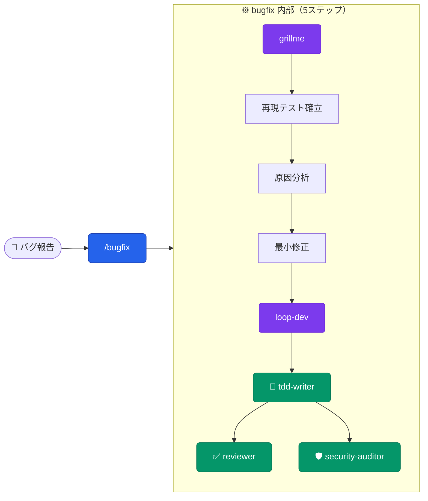

**トリガー**: バグ修正・不具合対応
**期待効果**: 再現テストを先に作るので「再現できないバグ」を直したつもりが残らない。回帰防止テストも自動追加

**実行例**:

```bash
/bugfix "ログイン直後にダッシュボードが空になる" src/dashboard/
```

---

### フルリファクタリング


**トリガー**: 5件以上のリファクタ・大規模コード整理
**期待効果**: clean → simplify（並列）→ perf → review を安全に自動連鎖。各段階の失敗は即ファイル単位でリバート、CRITICAL/HIGH 残存時は最終 gate でブロック

**実行例**:

```bash
/plan "認証層のユーティリティ重複を整理"
/refactor src/auth/
```

---

### コード単純化のみ

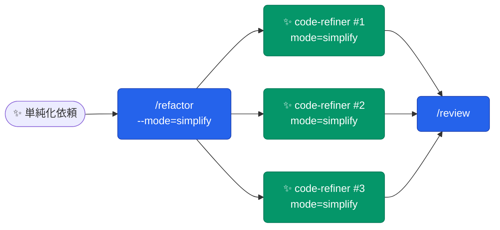

**トリガー**: 可読性・保守性向上のみ、機能変更なし
**期待効果**: 最大並列でファイルグループを同時単純化。clean / perf はスキップ

**実行例**:

```bash
/refactor --mode=simplify src/api/
```

---

### デッドコード掃除

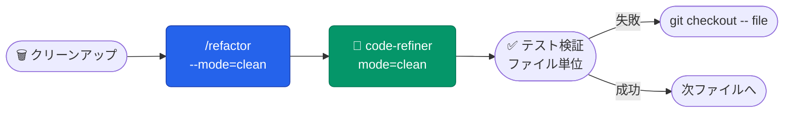

**トリガー**: 未使用コード・依存関係の削除
**期待効果**: 削除ごとにテスト実行、失敗時は即リバート。安全に dead code を排除

**実行例**:

```bash
/refactor --mode=clean
```

---

### クイック往復モード

`quick-code` / `quick-debug` / `quick-refactor` / `quick-review` / `quick-test` は同じ設計の5姉妹スキルです。人間が実行・検証を担い、Claude Code は差分だけを返す往復モードとしてまとめて扱います。

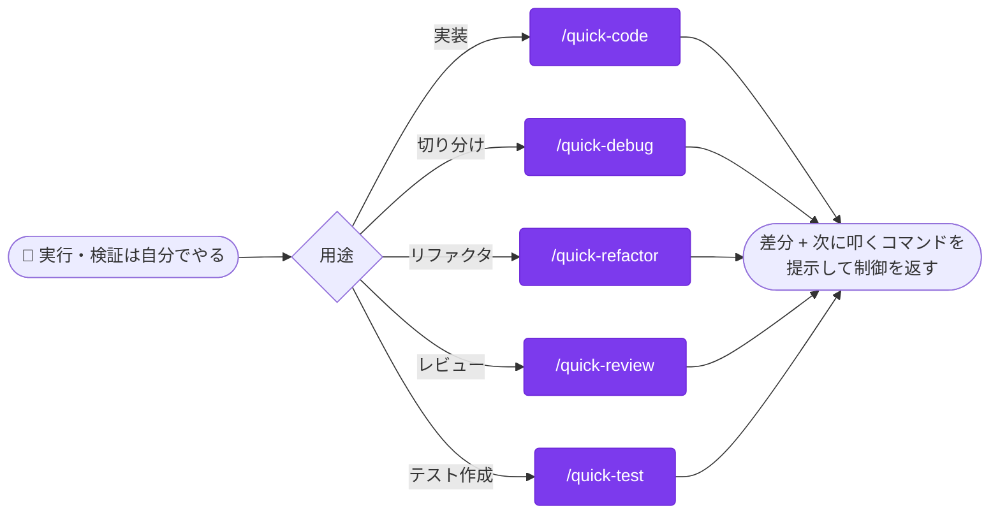

**トリガー**: 「自分でテストしなくていい」「実行は私がやる」等の明示時のみ（`disable-model-invocation` のため自動発火しない）
**期待効果**: 実行・検証を自分では行わず、最小差分と次に叩くコマンドだけを返す。人間側の反復速度を優先する往復モード。用途ごとに `/quick-code`（実装）`/quick-debug`（切り分け・修正は当てない）`/quick-refactor`（振る舞い不変の書き換え）`/quick-review`（確定指摘のみ適用）`/quick-test`（テストコードのみ）を使い分ける

**実行例**:

```bash
/quick-code "バリデーション追加" src/form.py
```

---

### テストコード自動生成


**トリガー**: テストコードの新規追加・カバレッジ補完
**期待効果**: デシジョンテーブルによるブランチ網羅 → 承認後に自動実装。失敗テストは自動修正しないので仕様の不明点が露呈する

**実行例**:

```bash
/test-gen src/auth/login.py
```

---

## 品質・セキュリティ

レビュー・監査・リリース検証など、品質とセキュリティを担保するワークフロー群です。

### セキュリティ重視の実装

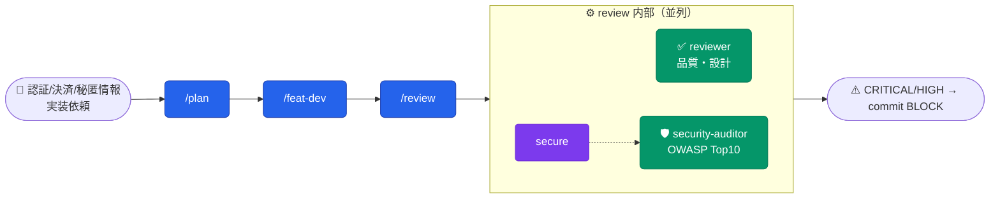

**トリガー**: 認証・決済・シークレット・API エンドポイント実装
**期待効果**: OWASP 検出 (security-auditor) + 設計チェックリスト (secure) の二段構え。CRITICAL/HIGH があれば commit をブロック

**実行例**:

```bash
/plan "決済モジュールに 3D セキュア対応を追加"
/feat-dev
/review
```

---

### 品質管理サイクル（定期メンテ）


**トリガー**: 週次・月次の品質チェック
**期待効果**: ハーネスで自動採点 → harness-tuner で改善案を適用 → 再採点で効果検証

**実行例**:

```bash
/harness repo
```

---

### ハーネス定期メンテ

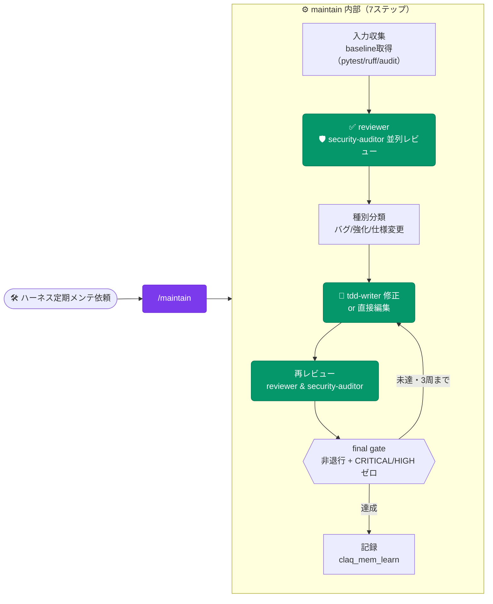

**トリガー**: 「ハーネスをメンテ」「プラグイン全体を見直して直す」等
**期待効果**: レビュー→修正→強化→再レビュー→記録を1回で完遂。単発の1ファイル修正は `/review` `/bugfix` `/refactor`、audit スコア改善のみなら `/harness` と使い分ける

**実行例**:

```bash
/maintain --scope=plugins/claq/hooks
```

---

### リリース前実起動検証

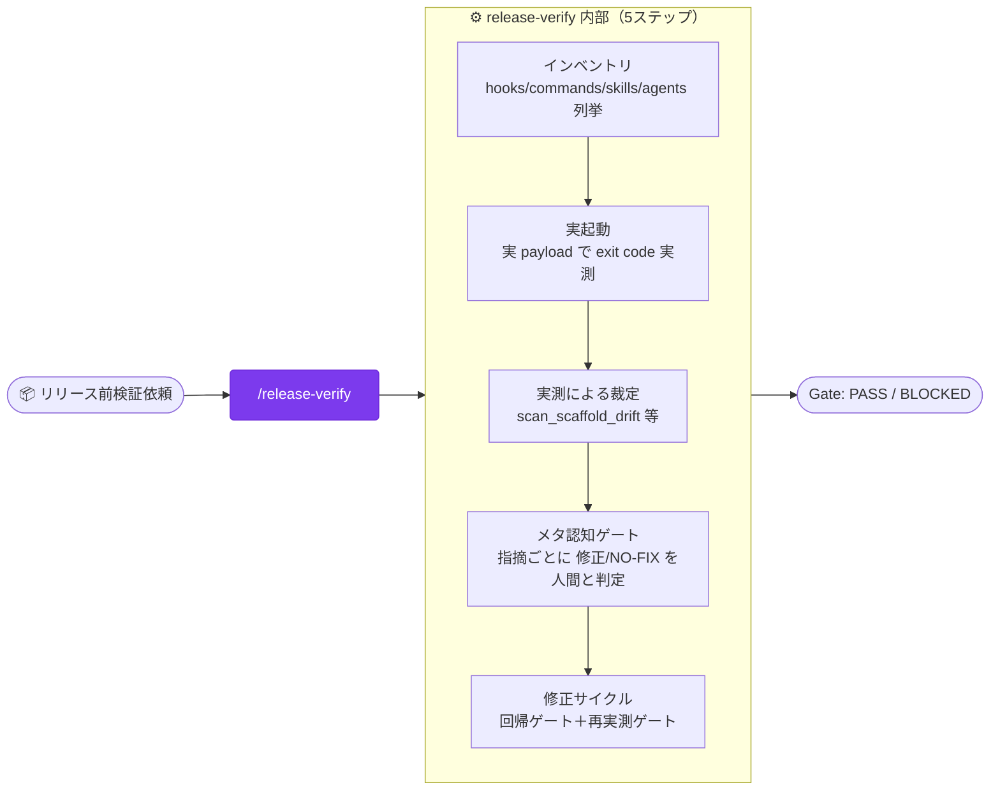

**トリガー**: 「リリース前検証」「インストール済みビルドを実際に呼んで確認」等
**期待効果**: 定義ファイルを読むだけでなく実起動で exit code を実測する。定義ファイルの drift 判定は `/maintain`、脆弱性レビューは `secure` スキル、収束品質の集計は `/loop-audit` と役割分担

**実行例**:

```bash
/release-verify
```

---

## スキル・知識管理

スキルの作成・改善と、セッションをまたぐ知識・進捗の蓄積を扱うワークフロー群です。

### スキル新規作成・改善

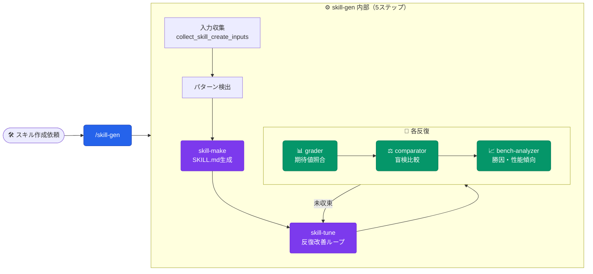

**トリガー**: 新スキル作成・既存スキル改善
**期待効果**: 生成→eval→ベンチマーク分析が自動連鎖。連続2回で新規不明瞭点ゼロ、または同一勝者で収束判定

**実行例**:

```bash
/skill-gen --commits=200 --knowledge
```

---

### 知識蓄積サイクル

各コマンド末尾の「学びの記録」ステップ（`/review` `/refactor` `/bugfix` `maintain` 等）で
agent/skill が明示的に `claq_mem_learn` を呼ぶことで知識カードが増える。自動バックグラウンド観測（旧
session-observer）は廃止済み — 定期実行や無操作での自動蓄積はない。

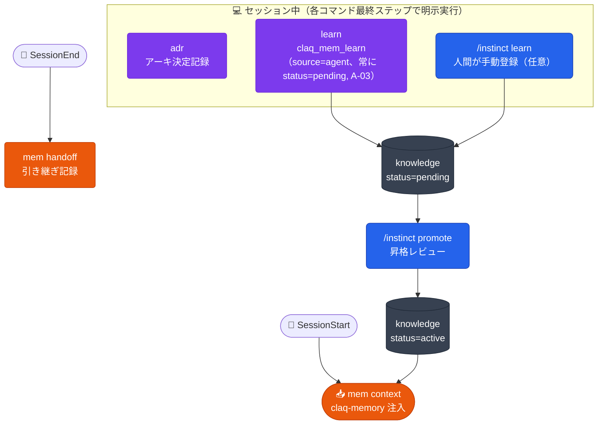

**トリガー**: 各コマンドの「学びの記録」ステップ（agent/skill が明示的に判断・実行。ユーザー操作は不要だがコマンド実行が前提）
**期待効果**: 再利用可能な学び（罠・規約・決定）が知識カードとして蓄積し次セッション以降へ自動注入。agent 由来カード（`claq_mem_learn`）は**常に** `status=pending` で登録され、`/instinct promote <key>` を経て初めて注入される（A-03）。`learn` に `--status` は無く、helper も CLI も指定を拒否する

**実行例**: 通常操作不要（各コマンドが完了時に自動判断）。手動登録した pending 分だけ週次で `/instinct list --status pending` → 採用分を `/instinct promote <key>`

---

### ループ収束品質診断

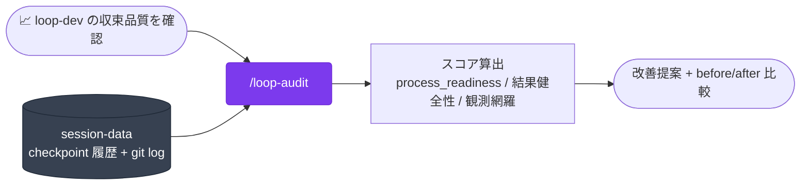

**トリガー**: `loop-dev` を使った開発サイクル（`feat-dev` / `bugfix` / `refactor` 等）の収束品質を振り返りたい時
**期待効果**: checkpoint 履歴・git log など一次データのみで決定論的にスコアリング。工程充足・結果健全性・観測網羅を分けて評価するため原因の切り分けが速い

**実行例**:

```bash
/loop-audit --since=2026-08-01
```

---

### 反復ループの中断復旧（自動）


**トリガー**: `loop-dev` / `maintain` 等の長い反復ループ内部から自動的に呼ばれる（ユーザーが直接呼ぶ運用は想定しない）
**期待効果**: レート制限中断が多いセッションでも、完了済みステップ・残りステップ・ベースラインを保存し再開を高速化する

**実行例**: 通常操作不要（対象スキル内部から自動的に保存・再開される）

---

## 新規生成

テンプレートを複製してゼロから何かを作るワークフロー群です。

### MCP サーバ新規構築

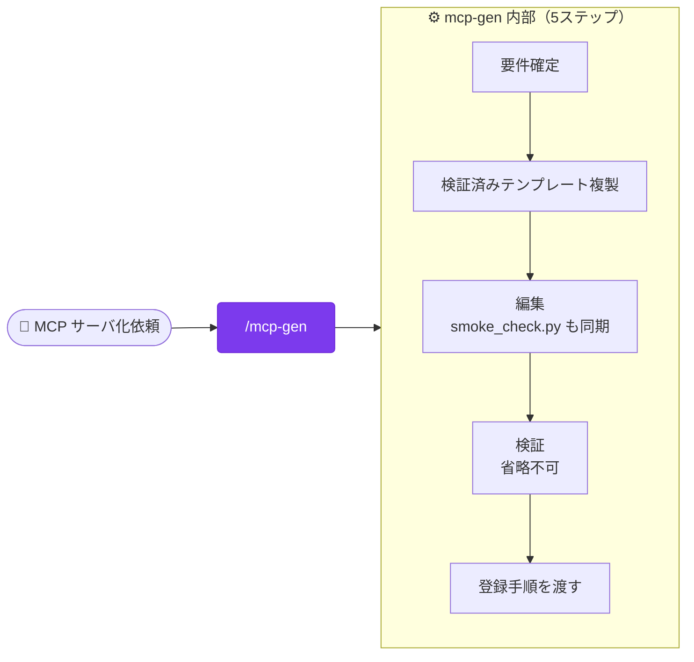

**トリガー**: 「MCP サーバを作って」「既存 API を MCP サーバにして」等
**期待効果**: 記憶で書かず検証済みテンプレートを複製するため設定ミスが起きにくい。実起動スモークで適合を確認するまで一気通貫。既存 MCP サーバの単発バグ修正は `/bugfix`、脆弱性レビューは `secure` スキル

**実行例**:

```bash
/mcp-gen "Notion API を MCP 化"
```

---

### shadcn/ui サイト・ダッシュボード新規作成

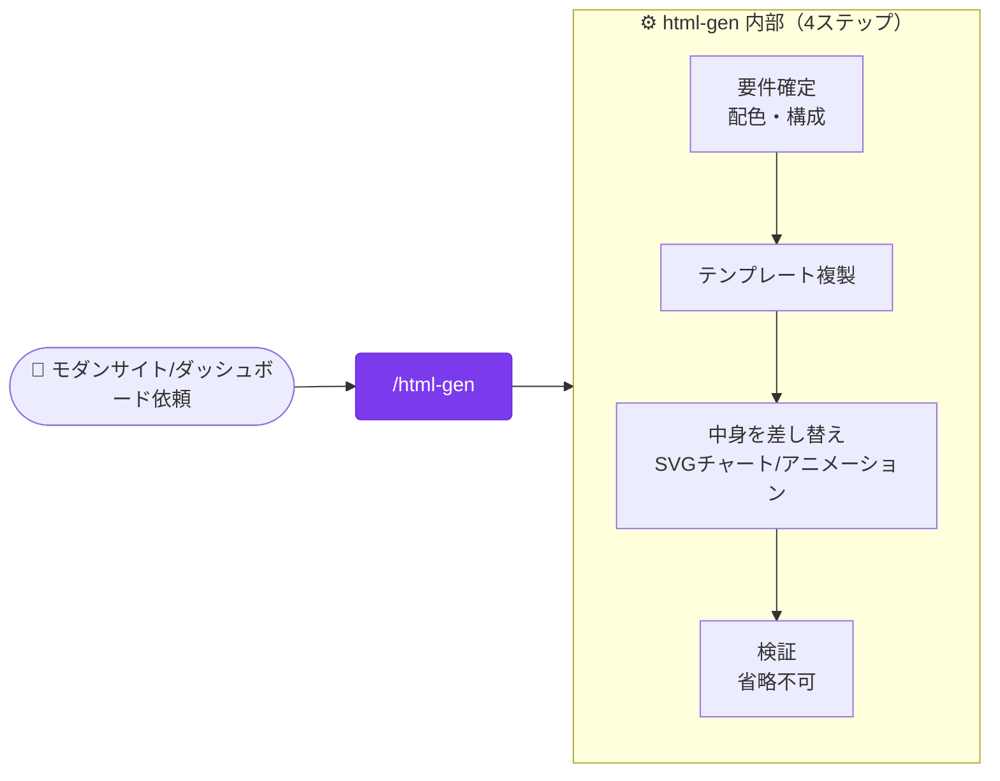

**トリガー**: 「shadcn でサイトを」「モダンな HTML ダッシュボードを作って」等
**期待効果**: 色を思い出しで書かず shadcn/ui のデザイントークンをテンプレートから複製。レスポンシブ（320〜1920px）・ライト/ダーク切替が既定。既存サイトの単発修正は `/bugfix`

**実行例**:

```bash
/html-gen "SaaS 管理画面ダッシュボード"
```

---

## 自動化

ユーザーの通常操作にフックして自動的に動くワークフロー群です。

### Git ワークフロー支援（自動アドバイス）


**トリガー**: `git commit` / `merge` / `rebase` / `push` 実行時（自動）
**期待効果**: 普通に git 操作するだけでベストプラクティスのアドバイスが自動注入

**実行例**: 通常の git 操作のみ。意識的に呼ぶ必要なし

---

## 🏗️ Architecture

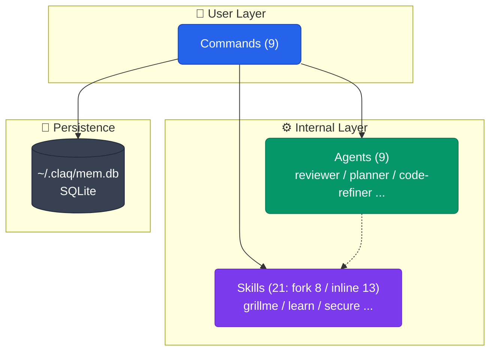

**設計方針**:

- ユーザーは **Commands のみ選択** すれば内部で Agents / Skills が自動連鎖
- スキルの `context: fork` は「ツール消費が報告より重く、ユーザーの応答も本文自体も親に不要」なものだけに付ける（fork は既定でバックグラウンド実行され対話・承認ゲートを持てないため）。対話/承認を伴う skill・本文や出力そのものが親の判断材料になる skill は inline。ユーザー直接起動の可否は `user-invocable` で独立に決める
- 永続化は **SQLite（個人）** の単層。テーブルは `repos` / `knowledge` / `sessions` の 3 つだけ
- 検索は埋め込みも FTS5 も使わず Python 側でスコアリング（ランタイム依存はゼロ、標準ライブラリのみ）
- 知識カードを書くのは Commands の「学びの記録」ステップのみ。Agents は候補を呼び出し元へ報告する

各コマンドの詳細仕様は [`plugins/claq/commands/`](plugins/claq/commands/) 配下を参照。
